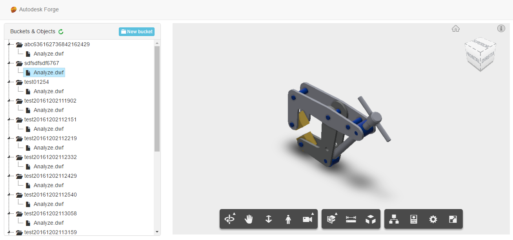

# model.derivative-csharp.webapi-viewer.sample


[](https://asp.net/)
[](http://opensource.org/licenses/MIT)

[](http://developer.autodesk.com/)
[](http://developer.autodesk.com/)
[](http://developer.autodesk.com/)
[](http://developer.autodesk.com/)

# Description

This basic C# WebAPI back-end sample implements a basic list of Buckets and Objects with an [Autodesk Forge 2 Legged OAuth](https://developer.autodesk.com/en/docs/oauth/v2/tutorials/get-2-legged-token/). The front-end was desiged with pure HTML + JavaScript (jQuery, Bootstrap), no ASPx features. It should look like:



 The Visual Studio solution includes 3 projects: 

**1. ASPNET.Webapi**: WebAPI backend that expose specific endpoints to the fron-end (pude HTML + JavaScript) via Controllers.

**2. Autodesk.Forge**: Class Library (.DLL) that wraps some of OAuth, OSS and Model Derivative endpoints in a meanifull way.

**3. Autodesk.Forge.Test**: Some testing methods.

### Live demo

Try it live at [modelderivative.apphb.com](http://modelderivative.apphb.com/) (hosted by [AppHarbor](https://appharbor.com/)). **Important**: this sample is public, therefore any file uploaded will be visible to others. 

# Setup

For using this sample, you need an Autodesk developer credentials. Visit the [Forge Developer Portal](https://developer.autodesk.com), sign up for an account, then [create an app](https://developer.autodesk.com/myapps/create) that uses Data Management and Model Derivative APIs. For this new app, use **http://localhost:3000/api/forge/callback/oauth** as Callback URL, although is not used on 2-legged flow. Finally take note of the **Client ID** and **Client Secret**.

## Run Locally

Open the **web.config** file and adjust the Forge Client ID & Secret.

```xml
<appSettings>
  <add key="FORGE_CLIENT_ID" value="" />
  <add key="FORGE_CLIENT_SECRET" value="" />
</appSettings>
```

Compile the solution, Visual Studio should download the NUGET packages ([RestSharp](https://www.nuget.org/packages/RestSharp) and [Newtonsoft.Json](https://www.nuget.org/packages/newtonsoft.json/))

Start the **ASPNET.webapi** project, the **index.html** is marked as start page. At the webpage, the **New Bucket** blue button allow create new buckets (as of now, minimum input validation is implemented). For any bucket, right-click to upload a file (objects). For demonstration, objects are not automatically translated, but right-click on a object and select **Translate**. 

## Run Test

Open the **ForgeApp.runsettings** file and adjust the Forge client ID and secret.

```xml
<RunSettings>
  <TestRunParameters>
    <Parameter name="FORGE_CLIENT_ID" value="" />
    <Parameter name="FORGE_CLIENT_SECRET" value="" />
  </TestRunParameters>
</RunSettings>
```

The **BucketWorkflow** test will create a bucket (named "test[timestamp]"), upload the testing file (/TestFile/Analyze.dwf) and post a translation job.

# Library usage

This solution includes a **Autodesk.Forge** class library that maps endpoints related to app buckets. 

```cs
// authenticate
OAuth.OAuth oauth = await OAuth2LeggedToken.AuthenticateAsync("Your client ID", "Your client secret",
new Scope[] { Scope.BucketRead, Scope.BucketCreate, Scope.DataRead, Scope.DataCreate, Scope.DataWrite });

// create bucket and get list of buckets in different conditions
AppBuckets app = new AppBuckets(oauth);
IEnumerable<Bucket> buckets = await buckets.GetBucketsAsync(10);

// create a random bucket
string bucketKey = string.Format("test{0}", DateTime.Now.ToString("yyyyMMddHHmmss"));
Bucket bucket = await app.CreateBucketAsync(bucketKey, PolicyKey.Transient);

// upload new object
OSS.Object newObject = await bucket.UploadObjectAsync(testFile);
// this URN can be used on the viewer
// but need to translate first...
string newObjectURN = newObject.ObjectId.Base64Encode();

// the list after should have 1 object...
IEnumerable<OSS.Object> objectsAfter = await bucket.GetObjectsAsync(int.MaxValue);
foreach (OSS.Object obj in objectsAfter)
{
    string urn = obj.ObjectId;
}

// translate
HttpStatusCode res = await newObject.Translate(new SVFOutput[] { SVFOutput.Views3d, SVFOutput.Views2d });
// now this newObject is ready for Viewer
```

# Know issues

The **ASPNET.webapi** project is adding reference to Newtonsoft.Json library due a dependency from another library (jsTree), but this is not required and cause a conflict of versions. If it happens, you can safely remove this reference (from ASPNET.webapi project).

# License

This sample is licensed under the terms of the [MIT License](http://opensource.org/licenses/MIT).
Please see the [LICENSE](LICENSE) file for full details.

## Written by

Augusto Goncalves (Forge Partner Development)<br />
http://forge.autodesk.com<br />
